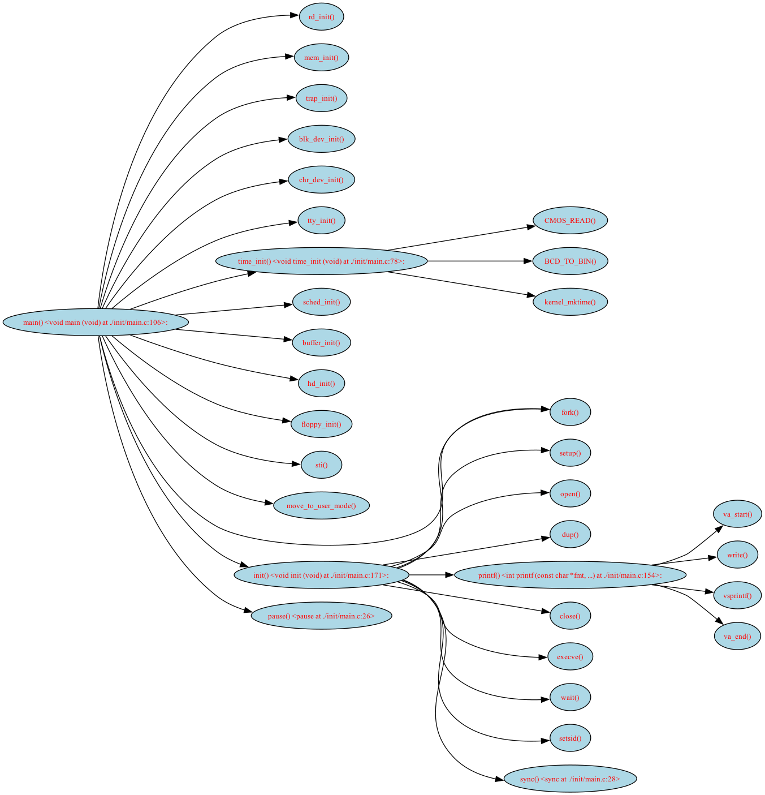

# Linux-0.11

The old Linux kernel source ver 0.11 runnable on MacOS, codes were modified to be compiled by modern i386 elf toolkit.

Tested on `MacOS Sonoma 14.2`.

## TOC

* [Linux-0.11](#linux-011)
   * [TOC](#toc)
   * [I. Clone Repo](#i-clone-repo)
   * [II. Installation](#ii-installation)
      * [Build on MacOS](#build-on-macos)
         * [MacOS Setup](#macos-setup)
   * [III. Quick Start](#iii-quick-start)
   * [IV. Advanced Usage](#iv-advanced-usage)
      * [1. Debug](#1-debug)
      * [2. Call Graph](#2-call-graph)
         * [2.1 Trial](#21-trial)
         * [2.2 Usage](#22-usage)
   * [V. References](#v-references)

## I. Clone Repo

Clone instruction:

```sh
git lfs clone https://github.com/ETOgaosion/Linux-0.11-MacOS.git
```

Or, if you have cloned already, use:

```sh
git lfs pull origin main
```

To download some important large files.

## II. Installation

### Build on MacOS

#### MacOS Setup

1. install cross compiler gcc, gdb and binutils

```sh
brew tap nativeos/i386-elf-toolchain
brew install i386-elf-binutils i386-elf-gcc
brew install i386-elf-gdb
```

2. install qemu

```sh
brew install qemu
```

3. [*optional*] a linux-0.11 hardware image file(we have offered one): hdc-0.11.img, you can download it from http://www.oldlinux.org, or http://mirror.lzu.edu.cn/os/oldlinux.org/, and put it in the root directory.
4. [*optional*] download [inkscape](https://inkscape.org/release/), and to use command-line tool:

```sh
ln -s /Applications/Inkscape.app/Contents/MacOS/inkscape \
      /usr/local/bin/inkscape
```

5. [*optional*] download [imagemagick](https://imagemagick.org/script/download.php#macosx), but don't follow their command line instructions(without X11 support), use below commands:

```sh
brew tap tlk/imagemagick-x11
brew install tlk/imagemagick-x11/imagemagick
```

set `DISPLAY` env variable:

```sh
echo 'export DISPLAY=:0' > ~/.[shell]rc
source ~/.[shell]rc
```

verify installation, as offically documented:

```sh
magick logo: logo.gif
identify logo.gif
display logo.gif
```

## III. Quick Start

```sh
make help           // get help
make                // compile
make start          // boot it on qemu
```

## IV. Advanced Usage

If you hope to dive deeper into linux, rather than just run and use, check below instructions. **Notice that all scripts shall be executed in root directory.**

### 1. Debug

In one terminal:

```sh
make debug          // debug it via qemu & gdb, you'd start gdb to connect it.
```

In the other:

```sh
gdb tools/system
(gdb) add-symbol-file boot/bootsect.o
(gdb) b start
(gdb) c
(gdb) remove-symbol-file boot/bootsect.o
(gdb) b main
(gdb) c
```

### 2. Call Graph

#### 2.1 Trial

Use `make cg` to generate `main` function's call graph like below:



#### 2.2 Usage

```sh
./scripts/callgraph.sh -f [func_name] \
                       -d [directory] \
                       -F [filterstr] \
                       -D [depth] \
                       -o [directory] \
                       -t [output_format_type]

# Output: out/func.dir_file_name.svg
```

If you want to directly convert picture to other format, we recommand you try [inkscape](https://inkscape.org/release/)

```sh
inkscape -w [width] -h [height] \
         out/[src_image].[src_type] \
         -o out/[dest_image].[dest_type]
```

Or if you only installed [imagemagick](https://imagemagick.org/script/download.php)

```sh
convert -density [density] \
        -background none \
        -resize [width]x[height] \
        out/[src_image].[src_type] \
        out/[dest_image].[dest_type]
```

And if you want to display image:

```sh
display out/[image].[type]
```

If you encounter errors, please make sure your installation correct. Open issues freely.

## V. References

1. [https://gitee.com/ethan-net/linux-0.11-lab](https://gitee.com/ethan-net/linux-0.11-lab)
2. [https://github.com/yuan-xy/Linux-0.11](https://github.com/yuan-xy/Linux-0.11)